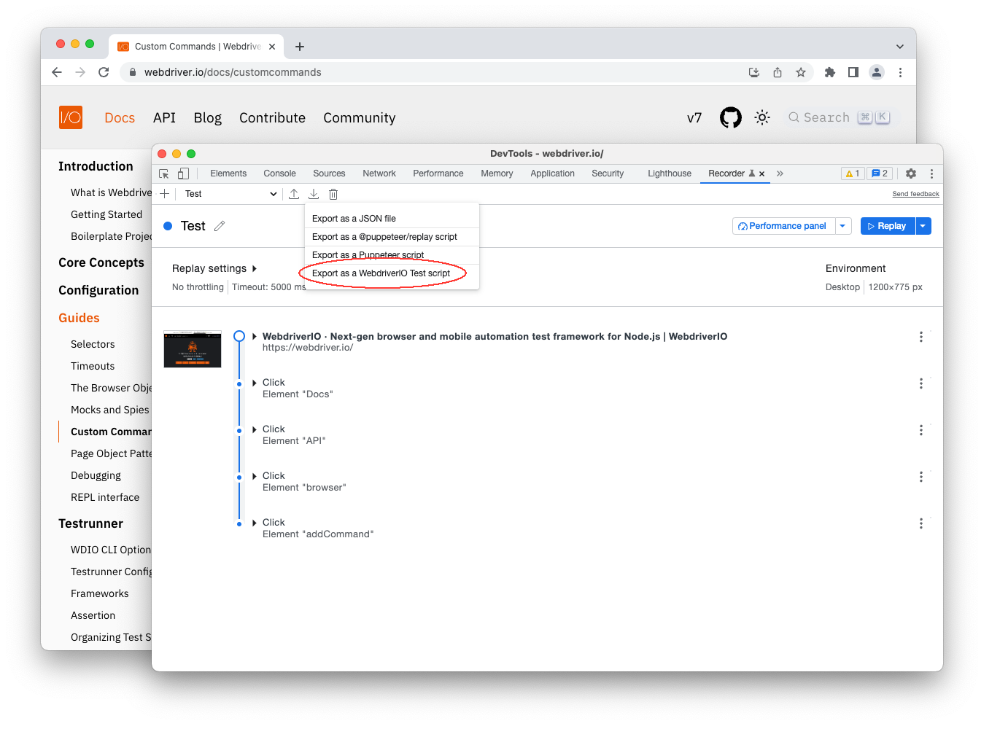

# WebdriverIO Recorder Extension

The WebdriverIO Recorder Extension allows you to record and export tests directly from the Chrome DevTools [Recorder Panel](https://goo.gle/devtools-recorder). 

# How to install and use it

Below are som quick step to help you get started. See [Record and export tests as WebdriverIO script](https://webdriver.io/docs/record) for the full documentation.

1. Install the [extension]([https://webdriver.io](https://chrome.google.com/webstore/detail/webdriverio-chrome-record/pllimkccefnbmghgcikpjkmmcadeddfn)) from Chrome Web Store. 
2. Open a new tab in the browser.
3. [Open DevTools](https://developer.chrome.com/docs/devtools/open/).
4. Open an existing user flow or [record a new user flow](https://goo.gle/devtools-recorder) with the Recorder panel.
5. [Export the user flow](https://developer.chrome.com/docs/devtools/recorder/reference/#export-flows) as WebdriverIO test script. 
6. [Run the test script](https://webdriver.io/docs/clioptions) with the [WebdriverIO Testrunner](https://webdriver.io/docs/setuptypes#the-wdio-testrunner) or as [Standalone](https://webdriver.io/docs/setuptypes#standalone-mode)!

## Export user flows as WebdriverIO test scripts programmatically

Use the [WDIO Chrome Recorder](https://github.com/webdriverio/chrome-recorder) CLI to Export user flows as WebdriverIO test scripts programmatically.

---

For more information on WebdriverIO see the [homepage](https://webdriver.io).
